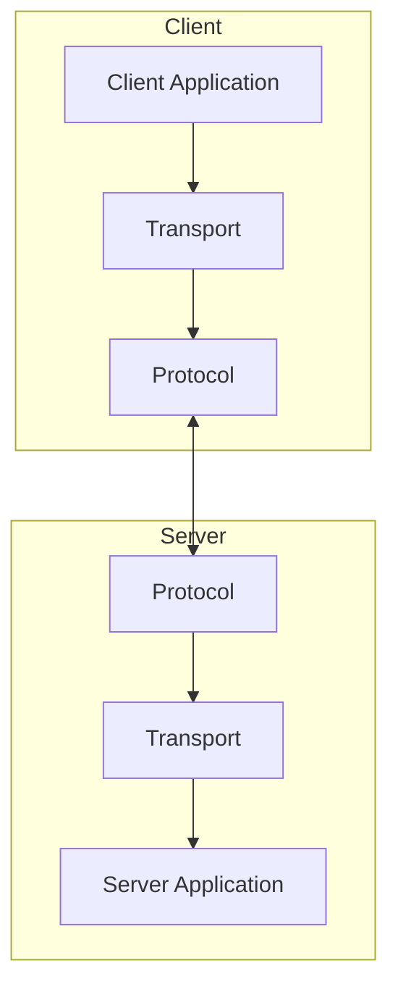

# Task: Create Architecture Overview Documentation

**Status**: 🔴 Not Started  
**Assignee**: Unassigned  
**Estimated effort**: 1 day (SDE2 level)  
**Priority**: Medium (P2)  
**Package**: All packages
**Prerequisites**: 
- API documentation (001-api-documentation)
- Basic usage examples (002-usage-examples)

## Context
We need to create comprehensive architecture documentation that explains the design, structure, and principles of the MCP SDK implementation. This documentation should help developers understand how the system works and guide them in making architectural decisions.

## Requirements
1. Document system architecture
2. Create architectural diagrams
3. Explain design decisions
4. Document system flows
5. Provide implementation guidance

## Detailed Implementation Plan

### 1. Documentation Structure

```
docs/architecture/
├── overview.md              # High-level overview
├── core/
│   ├── types.md            # Core type system
│   ├── protocols.md        # Protocol handling
│   └── extensions.md       # Extension points
├── components/
│   ├── server.md           # Server architecture
│   ├── client.md           # Client architecture
│   └── transport.md        # Transport system
├── features/
│   ├── resources.md        # Resource handling
│   ├── tools.md            # Tool system
│   └── prompts.md          # Prompt handling
└── diagrams/
    ├── system.mmd          # System diagrams
    ├── flows.mmd           # Flow diagrams
    └── components.mmd      # Component diagrams
```

### 2. Core Architecture Documentation

```markdown
# MCP Architecture Overview

## System Design

The MCP SDK is designed around these core principles:
- Type safety and correctness
- Extensibility
- Clear separation of concerns
- Robust error handling

### Core Components

The system is divided into three main packages:
1. mcp-core: Core types and protocols
2. mcp-server: Server implementation
3. mcp-client: Client implementation

### Type System

The type system ensures:
- Protocol conformance
- Safe message handling
- Resource type safety
- Tool execution safety

### Protocol Design

The protocol layer provides:
- Version negotiation
- Capability detection
- Message framing
- Error handling
```

### 3. Component Documentation

```markdown
## Server Architecture

### Design Goals
- Clean separation of concerns
- Extensible resource handling
- Flexible tool execution
- Robust error recovery

### Key Components

1. Transport Layer
   - Message framing
   - Connection handling
   - Stream management

2. Protocol Layer
   - Message routing
   - State management
   - Session handling

3. Feature Layer
   - Resource management
   - Tool execution
   - Prompt handling

### Implementation Patterns

Common patterns include:
- Type-safe builders
- Resource cleanup
- Error propagation
- State transitions
```

### 4. System Diagrams



## Documentation Components

1. Overview Documents:
   - System architecture
   - Design principles
   - Core concepts
   - Extension points

2. Technical Details:
   - Type system
   - Protocol design
   - Component interaction
   - State management

3. Implementation Guides:
   - Best practices
   - Design patterns
   - Error handling
   - Testing strategies

## Testing Requirements

1. Document Tests:
   - All links valid
   - All diagrams render
   - Code examples compile

2. Technical Review:
   - Architecture accuracy
   - Design principles
   - Implementation guidance

3. Quality Checks:
   - Consistency
   - Completeness
   - Clarity

## Files to Create/Modify
1. All files under `docs/architecture/`
2. Update main README.md
3. Update package documentation
4. Generate architecture diagrams

## Dependencies
```yaml
dependencies:
  - mermaid-cli
  - pandoc
  - graphviz
```

## Acceptance Criteria
1. Architecture documented
2. Diagrams clear
3. Design explained
4. Flows documented
5. Principles clear
6. Examples working
7. Links valid
8. Style consistent

## Non-Goals
1. Implementation details
2. API documentation
3. User guides
4. Tutorial content

## Resources
1. Architecture Documentation Patterns
2. Technical Writing Guidelines
3. Diagram Best Practices